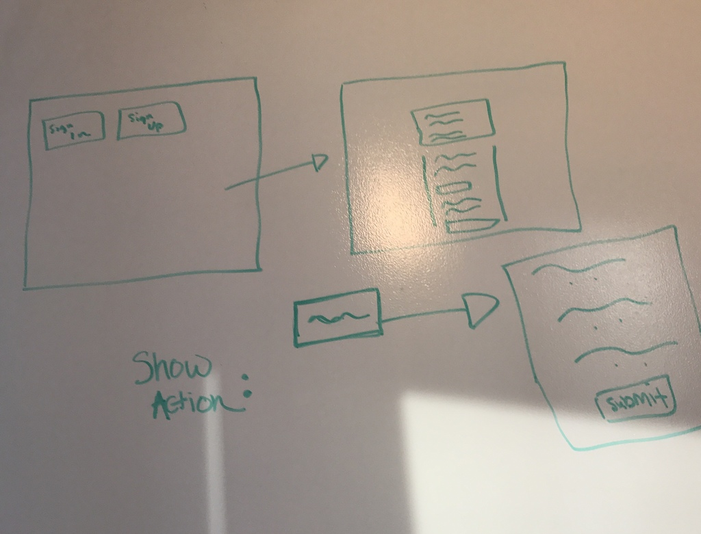
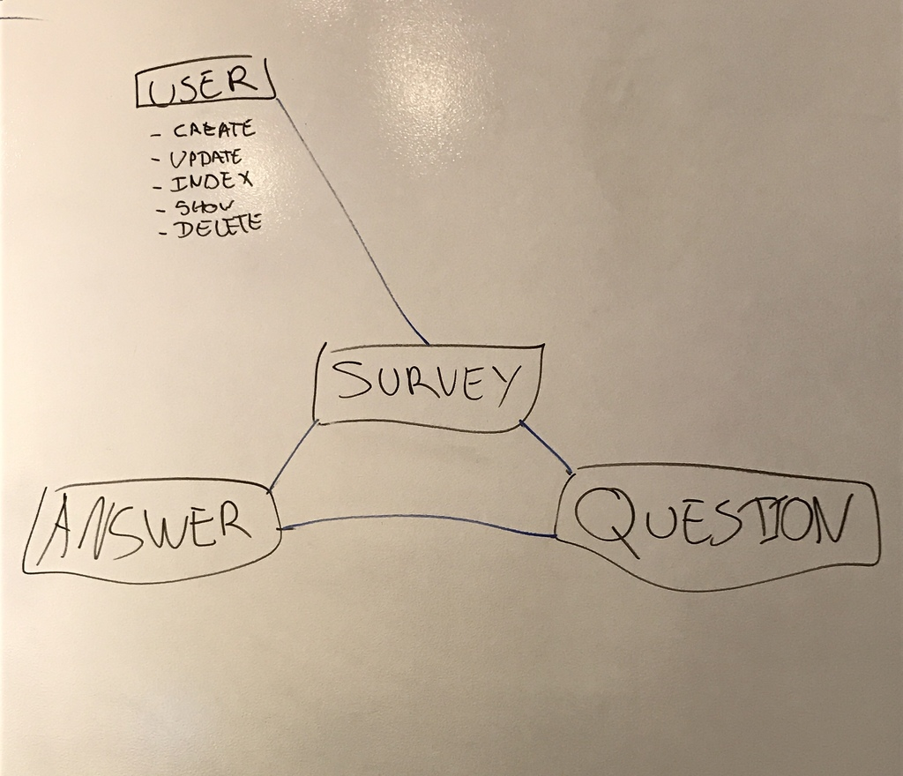
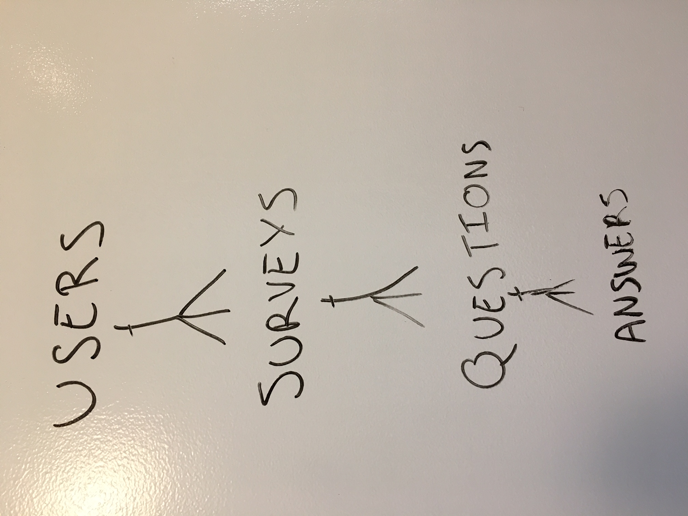

## Links

[Back-end repo] (https://github.com/GZMJ-Survey/express-api-survey)
[Website] (https://gzmj-survey.github.io/client-survey/)

# About

This survey team project front end interacts with it's back end. The app lets a user have authorization, and have/take surveys. This app does not use any extra npm dependencies. This survey app allows users to log in and create their own surveys! The author of a survey can always add new questions to their survey as well as see how many people voted yes or no to each of the survey questions. Users can also submit answers to other users surveys. A user must answer all of the survey questions to submit their answers to a survey otherwise their answers will not be counted and they will see a message asking them to answer all of the questions.


## Team Members:

-  Maxime Dore
-  Gabrielle Williams
-  Zhu Chen
-  Jana Ryndin


## Tasks

Make an app that can be used to create custom surveys and collect the responses
on a dashboard for that particular survey.


## User Stories

Our user are one of 2 people. They are either creating/deleting surveys, and
adding questions, or taking surveys.

####As a user I want to:
-   create an account.
-   log in and log out.
-   change password.
-   create new survey.
-   delete survey.
-   Add questions to my surveys.
-   Anwer anyone's survey questions.
-   view survey stat(s).

####Extras:
-   edit responses.
-   share surveys.

## Wireframe & ERDs

Wireframe:


1st ERD:


2nd ERD:


## Development

1. Consulted with consultants regarding requirements and technical details of
development.
2. Each member of the team made sure we the same page regarding what we wanted
to create and how to go about the development.
3. Started with back end. developed CRUD actions for surveys and tested them.
4. Had the owners have ownership of surveys and tested them.
5. Create basic forms on the front end to test CRUD actions with back end.
6. Create and read actions worked but the update action for a new question was
problematic because it was replacing the already existing question and was not
adding a new question to the array. The solution being pushing the new
question to the survey array of question in the update controller.
7. We tested the update action on the backend and front end.
8. Used handlebars to diplay all surveys, questions, and answers.
9. Began working on getting the "submit answer" to work which is also a PATCH on
the survey. This was quite challenging.
10. Then added 'add question form' to survey handlebars, so it would display on
each survey.
11. Made sure only the author of the survey could add questions or delete
12. For each action, had the survey index function run afterwards to update
surveys.
13. Fixed sign up confirmation bug.
14. Added message div to display whether each action was a success or failure.
15. Displayed each survey stats.
16. Deployed.

## Difficulties

The main difficulty we came accross was dealing with schema inside of schemas
(inside of schema, inside another schema), all as arrays. Updating was the most
tricky.

Submitting the user's answers for the surveys was tricky. We needed a for loop to loop through each survey, then take in the responses via radio buttons and add these responses to the answers for the survey and also count the number of times the questions in a particular survey were answered.

```
const onAnswer = function(event) {
  event.preventDefault();

  let size = 0;
  let specificSurvey;
  for(let i=0; i<surveyStore.survey.length; i++){
    if (surveyStore.survey[i].id === $(this).data("id")){
      size = surveyStore.survey[i].questions.length;
      specificSurvey = surveyStore.survey[i];
    }
  }

let counter = 0;
  let problems = [];
  for (let i = 0; i < size; i++) {
    let id = specificSurvey.questions[i].id;

    let result = {};
    if ($(`input:radio[name=${id}]:checked`).val() !== undefined) {
      counter++;
    }

    result = {
     answers: {
      response: $(`input:radio[name=${id}]:checked`).val()
     }
    };
    problems.push(result);
  }

  if (counter === problems.length) {
    let data = {
      survey: {
        questions: problems
      }
    };
    api.updateAnswer(data, $(this).data("id"))
    .then(ui.successAnswer)
    .then(onSurveyIndex)
    .catch(ui.failureAnswer);
  } else {
    $('.submission-error').text("Please answer all questions!");
  }
};
```
Another difficult part was getting the surveys to display correctly. Since only the user can destroy their own survey but they cannot submit answers to their survey we needed to have the show surveys function validate that the user was the author so that each survey would display appropriate actions. Then, each survey is displayed within an accordion so that online the titles of the survey are visible until the user clicks them.

```

const onSurveyShow = function (event) {
  event.preventDefault();
  let id = $(event.target).data("id");
  api.surveyShow(id)
  .then((response)=> {
    let survey= response.survey;
    //show user message if no questions in survey
    survey.questions.length===0?
    $('.empty-survey').text("There are currently no questions in this survey.")
    :$('.empty-survey').empty();

    $('.submission-error').empty();

    let yesAnswers;
    let noAnswers;

    for(let k=0; k<survey.questions.length; k++){
      yesAnswers=0;
      noAnswers=0;
      for(let i=0; i<survey.questions[k].answers.length;i++){
        if (survey.questions[k].answers[i].response === true){
          yesAnswers++;
        } else {
          noAnswers++;
        }
      }
      $(`.count-true[name=${survey.questions[k].id}]`).text(`Voted: ${yesAnswers} times`);
      $(`.count-false[name=${survey.questions[k].id}]`).text(`Voted: ${noAnswers} times`);
    }

    if (response.survey.questions[0] !== undefined){
      $('.survey-alerts').text("Survey, " + response.survey.title + ", has been used " + response.survey.questions[0].answers.length + " times.");
    }

    if (store.user.id !== response.survey._owner){
      $('.add-question-form').hide();
      $('.survey-destroy').hide();
      $('.answer-question').show();
      $('.col-1-radio').show();
      $('.col-2-radio').show();
      survey.questions.length===0? $('.answer-question').hide() : $('.answer-question').show();

    } else {
      $('.add-question-form').show();
      $('.survey-destroy').show();
      $('.answer-question').hide();
      $('.col-1-radio').hide();
      $('.col-2-radio').hide();
    }

    let clicked = $(this);
    if (clicked.hasClass('open')) {
      clicked.removeClass('open');
      clicked.next('.survey-contents').stop().slideUp(500);
      clicked.find('.fa').removeClass('fa-chevron-up').addClass('fa-chevron-down');
    } else {
      let open = $('.survey-show.open');
      open.next('.survey-contents').slideUp(500);
      open.find('.fa').removeClass('fa-chevron-up').addClass('fa-chevron-down');
      open.removeClass('open');
      clicked.addClass('open');
      clicked.next('.survey-contents').stop().slideDown(500);
      clicked.find('.fa').addClass('fa-chevron-up').removeClass('fa-chevron-down');
    }
  })
  ;
};

```

## Tehcnologies used

Mac computers, chrome, npm package, heroku.
